# 🗝️ Classical-Crypto-GUI-Toolkit

### Classical Cryptography Desktop Toolkit

**Classical-Crypto-GUI-Toolkit** is a **Python-based desktop application** for experimenting with classical ciphers and cryptanalysis.

It is designed for **students, security enthusiasts, and developers** who want to learn or demonstrate classical encryption techniques using an intuitive graphical interface.

All operations are **local**, ensuring **full offline use and privacy**.

---

## 🖥️ CLI Alternative

For users who prefer terminal-based interaction:

👉 A CLI version provides similar functionality through command-line commands.

🔗 CLI Repository: **[Classical-Crypto-CLI-Toolkit](https://github.com/ShakalBhau0001/classical-crypto-cli-toolkit)**

---

## ✨ Key Principles

1. **Learning-focused** – ideal for beginners exploring cryptography  
2. **GUI-centric** – built using CustomTkinter for clarity and usability  
3. **Modular architecture** – separates cipher logic from interface layer  

This toolkit is educational, yet fully functional, with each cipher and attack implemented independently.

---

## 🧩 Included Modules

### 🔐 Classical Ciphers

- Caesar Cipher – shift-based substitution  
- Playfair Cipher – digraph-based substitution  
- Rail Fence Cipher – zig-zag transposition cipher  
- Row Column Cipher – columnar transposition cipher  

### 🧪 Attacks

- Caesar Brute Force Attack – tries all possible shifts  
- Rail Fence Brute Force Attack – tries multiple rail values  

---

## 📁 Project Structure

```bash
classical-crypto-gui-toolkit/
│
├── LICENSE
├── main.py
├── README.md
├── requirements.txt
│
├── core/
│   ├── __init__.py
│   ├── utils.py
│   ├── ciphers/
│   │   ├── __init__.py
│   │   ├── caesar.py
│   │   ├── playfair.py
│   │   ├── rail_fence.py
│   │   └── row_column.py
│   │
│   └── attacks/
│       ├── __init__.py
│       ├── caesar_brute.py
│       └── rail_fence_brute.py
│
└── gui/
    ├── __init__.py
    ├── app.py
    ├── main_window.py
    ├── theme.py
    ├── validators.py
    │
    ├── components/
    │   ├── __init__.py
    │   ├── action_buttons.py
    │   ├── base_attack_frame.py
    │   ├── base_cipher_frame.py
    │   ├── sidebar.py
    │   └── text_area.py
    │
    └── panels/
        ├── __init__.py
        ├── about_panel.py
        ├── attack_panel.py
        ├── cipher_panel.py
        │
        ├── attacks/
        │   ├── __init__.py
        │   ├── caesar_attack_panel.py
        │   └── railfence_attack_panel.py
        │
        └── ciphers/
            ├── __init__.py
            ├── caesar_panel.py
            ├── playfair_panel.py
            ├── rail_fence_panel.py
            └── row_column_panel.py
```

> Core cryptographic logic is strictly separated from the GUI layer for maintainability and clarity.

---

## 🚀 Getting Started

### 1️⃣ Clone Repository

```bash
git clone https://github.com/ShakalBhau0001/classical-crypto-gui-toolkit.git  
cd classical-crypto-gui-toolkit
```

### 2️⃣ Install Dependencies

```bash
pip install -r requirements.txt
```

### 3️⃣ Run Application

```bash
python main.py
```

---

## 🖼️ GUI Overview

The application provides:
- Sidebar navigation between Cipher, Attack, and About panels  
- Dedicated panels for each cipher  
- Brute-force attack interfaces with result display  
- Clear separation between input and output text areas  

> Designed to be beginner-friendly and easy to extend.

---

## 📦 requirements.txt

```txt
customtkinter
cryptography
```

---

## ⚠️ Security Disclaimer

This toolkit is **educational and research-focused**.  
It uses classical ciphers and is **not suitable for modern secure communication**.

---

## 🛣️ Roadmap

- Additional classical cipher implementations  
- Frequency analysis tools  
- Export results functionality  
- Standalone executable packaging  

---

## 📸 Preview

### A. Cipher Panel

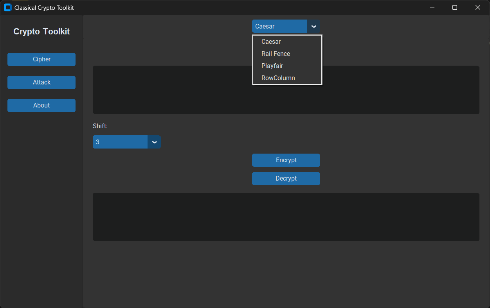

### 1. Caesar Encryption


### 2. Caesar Decryption

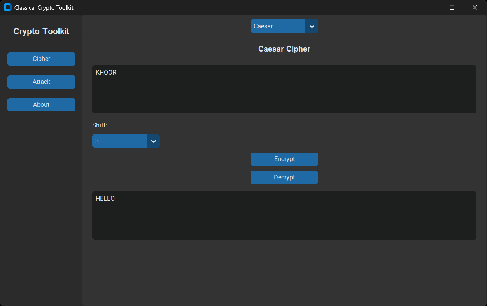

### 3. Rail_Fence Encryption

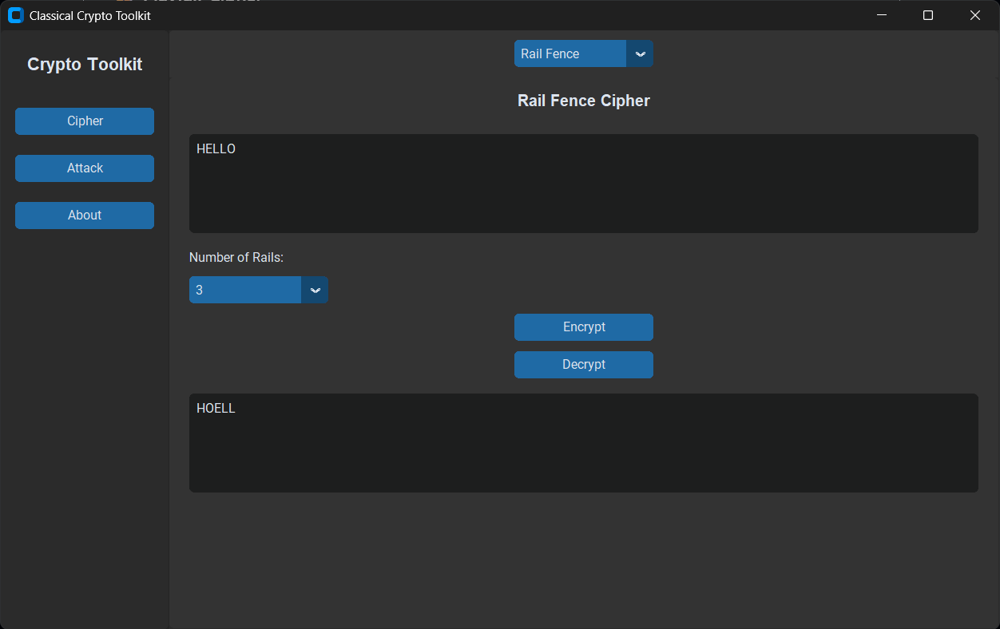

### 4. Rail_Fence Decryption

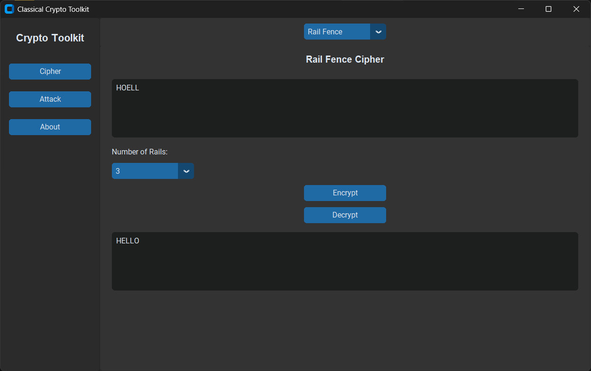

### 5. Playfair Encryption


### 6. Playfair Decryption

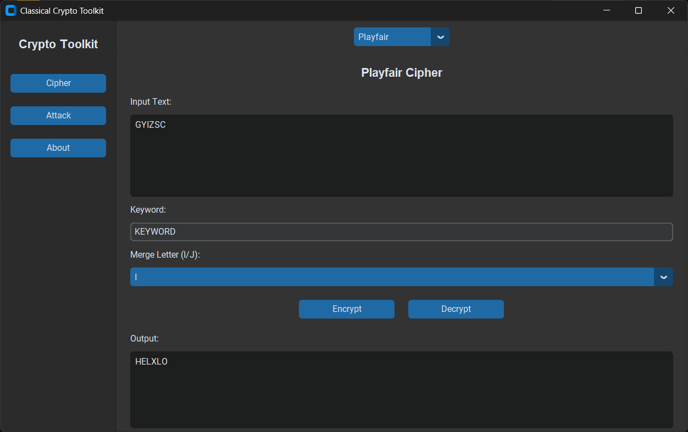

### 7. Row_Column Encryption

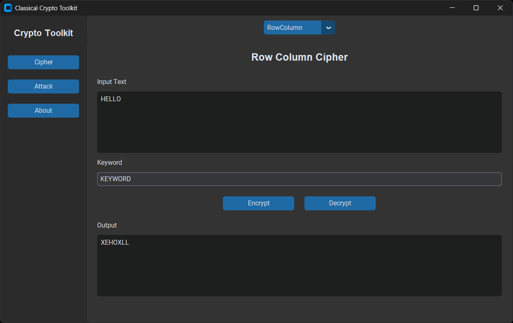

### 8. Row_Column Decryption

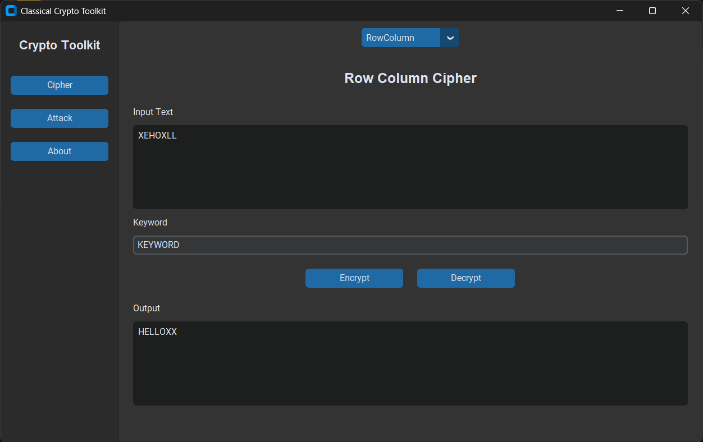

### B. Attack Panel

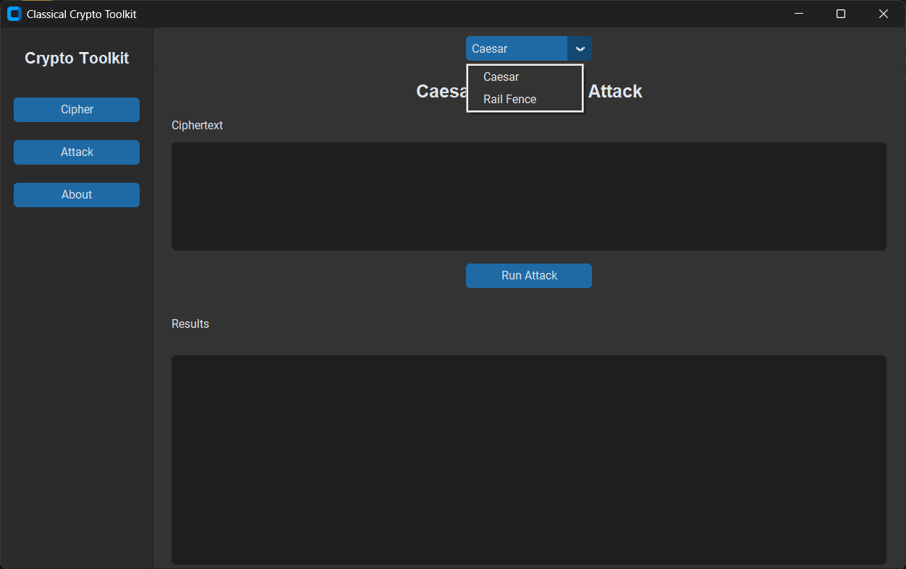

### 1. Caesar Brute Force

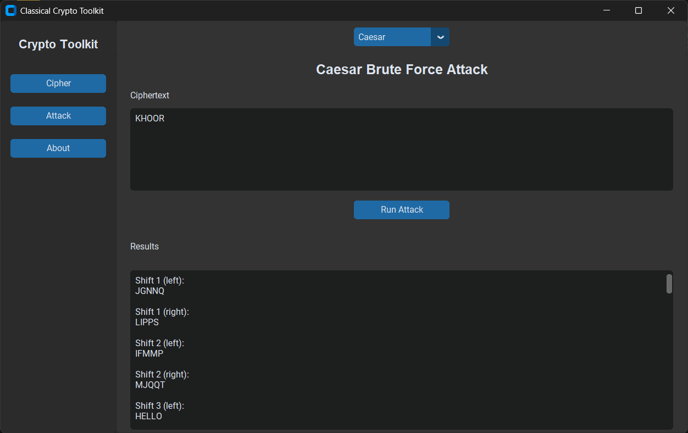

### 2. Rail_Fence Brute Force

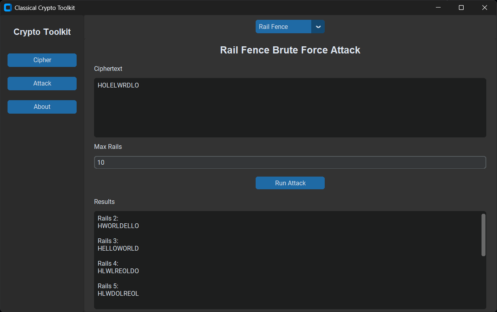

### C. About Panel

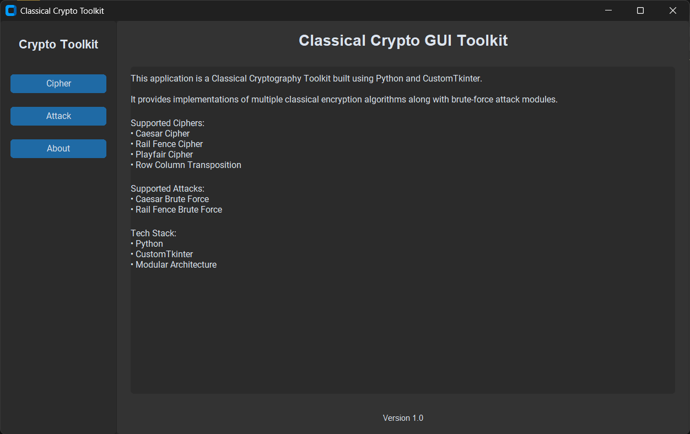

---

## 🪪 Author

> Developer: **Shakal Bhau**
 
> GitHub: **[ShakalBhau0001](https://github.com/ShakalBhau0001)**

---

> “Classical ciphers teach discipline before modern encryption.”

---

## ⭐ Support

If you like this project, consider giving it a ⭐ on GitHub!

---
